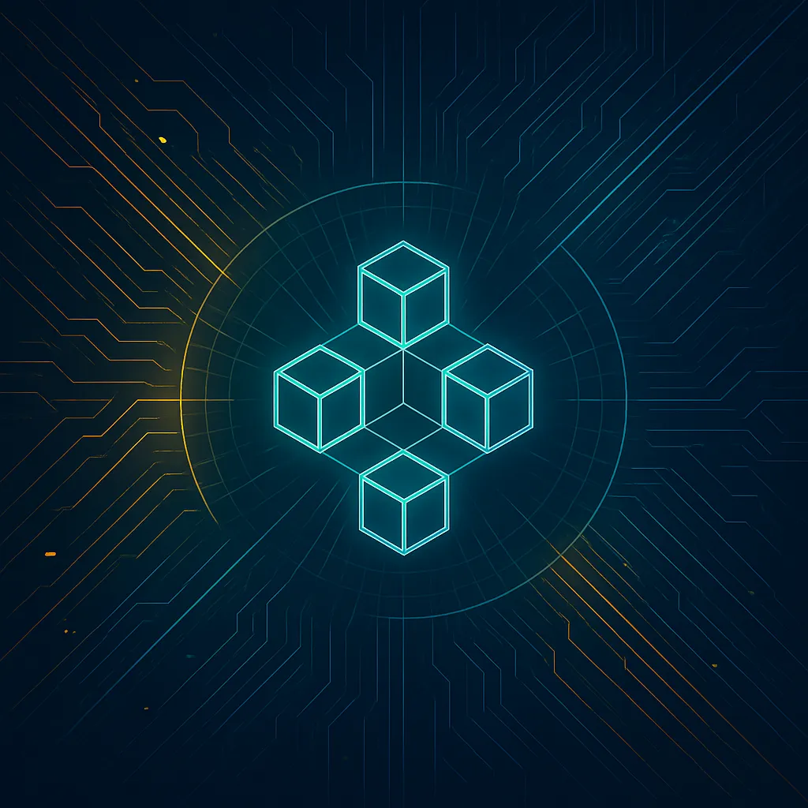

# Blockchain Event Flow Visualizer

<div align="center">
  
</div>

## Table of Contents

- [Overview](#overview)
- [Key Concepts Visualized](#key-concepts-visualized)
- [Visualized Flows](#visualized-flows)
  - [Multisig Minting USDA Flow](#multisig-minting-usda-flow)
  - [Multisig Burning USDA Flow](#multisig-burning-usda-flow)
  - [Token Staking Flow](#token-staking-flow)
  - [Cross-Chain Bridge Flow](#cross-chain-bridge-flow)
  - [Decentralized Exchange (DEX) Flow](#decentralized-exchange-dex-flow)
  - [DAO Governance Flow](#dao-governance-flow)
  - [Lending/Borrowing Flow](#lendingborrowing-flow)
  - [QAR Token Flow](#qar-token-flow)
  - [QAR Token Cron Flow](#qar-token-cron-flow)
- [AI-Powered Explanations](#ai-powered-explanations)
  - [Supported AI Models](#supported-models-by-provider)
  - [Configuration](#configuration)
  - [Usage](#usage)
  - [Provider Selection](#provider-selection)
  - [Fallback Mechanism](#fallback-mechanism)
  - [Adding a New Provider](#adding-a-new-provider)
  - [Architecture](#architecture-1)
  - [Provider-Specific Notes](#provider-specific-notes)
    - [OpenAI Provider](#openai-provider)
    - [Gemini Provider](#gemini-provider)
    - [Anthropic Claude Provider](#anthropic-claude-provider)
  - [CORS Handling](#cors-handling)
- [Running the Application](#running-the-application)
  - [Prerequisites](#prerequisites)
  - [Setup Instructions](#setup-instructions)
  - [Code Quality Tools](#code-quality-tools)
- [Vite Migration](#vite-migration)
  - [Environment Variables](#environment-variables)
  - [Development Server](#development-server)
  - [Building for Production](#building-for-production)
  - [Deploying to Vercel](#deploying-to-vercel)
- [Architecture](#architecture)
- [Technologies](#technologies)

An interactive visualization tool for understanding the event flow in blockchain systems, specifically focused on the multisig minting USDA flow between quantum-relayer and quantum-contracts.

## Overview

This visualization represents the event emitter architecture where:

**Actors (Blue Boxes)** are event emitters that:
- Broadcast events to the pool
- Handle events they are listening for

**Event Emitter Pool (Gray Box)** coordinates communication:
- Receives broadcasted events from actors (blue event lines)
- Sends events to actors listening for specific events (amber proposal lines)

**Event Handlers (Purple Boxes)** process specific events

**New Actors (Teal Box)** can be introduced with their own set of handlers

## Key Concepts Visualized

- **Event Broadcasting**: How events flow from actors to the event pool
- **Event Handling**: How specific actors process relevant events
- **Multisig Minting Flow**: The specific flow for USDA minting involving multiple actors

## Visualized Flows

### Multisig Minting USDA Flow
This flow visualizes the process of minting USDA tokens through a multisig approval system:
1. User initiates a bridge transfer on the source chain
2. Tokens are locked in the bridge contract
3. Lock event is emitted on the source chain
4. Event is relayed to the AO Event Pool
5. AO USDA EventHandler validates the event
6. Mint proposal is created in the multisig contract
7. Validators review and vote on the proposal
8. Once quorum is reached, the proposal is approved
9. Mint transaction is executed on the target chain
10. New USDA tokens are minted to the recipient's address
11. Mint confirmation event is emitted
12. User receives notification of successful mint

### Multisig Burning USDA Flow
This flow visualizes the process of burning USDA tokens through a multisig approval system:
1. User initiates a burn request in the dApp
2. USDA tokens are sent to the burn address
3. Burn event is emitted on the blockchain
4. Event is captured by the AO Event Pool
5. AO Burn Handler processes the event
6. Burn proposal is created in the multisig contract
7. Validators review and vote on the proposal
8. Once approved, the burn is confirmed
9. Equivalent assets are released on the target chain
10. Burn confirmation is sent to the user
11. Transaction is recorded in the event log
12. User interface updates to reflect the completed burn

### Token Staking Flow
This flow visualizes the process of staking tokens and earning rewards:
1. User connects their Web3 wallet to the staking interface
2. Interface displays available staking pools and APY
3. User selects tokens and amount to stake
4. Smart contract verifies token balance and allowance
5. User approves the staking contract to spend tokens
6. Tokens are transferred to the staking contract
7. Staking position NFT is minted to the user's wallet
8. Rewards begin accumulating based on staked amount and time
9. User can monitor their position and rewards in real-time
10. User can claim rewards at any time, which are auto-compounded
11. After the lockup period, user can unstake tokens
12. Tokens and remaining rewards are transferred back to the user's wallet

### Cross-Chain Bridge Flow
This flow visualizes the process of transferring assets between different blockchains:
1. User connects wallet and selects source and destination chains
2. Chooses token and amount to bridge
3. Approves token spending if needed
4. Tokens are locked in the bridge contract on the source chain
5. Bridge validators detect and validate the transaction
6. Validators reach consensus on the transaction
7. Proof of the transaction is generated
8. Relayers submit the proof to the destination chain
9. Equivalent tokens are minted on the destination chain
10. User receives bridged tokens in their wallet
11. Transaction is recorded on both chains
12. User receives confirmation of the completed bridge

### Decentralized Exchange (DEX) Flow
This flow visualizes the process of swapping tokens on a DEX:
1. User connects their wallet to the DEX interface
2. Selects input and output tokens
3. Enters the amount to swap
4. Interface fetches the best available price and slippage
5. User approves token spending if needed
6. Transaction is signed and submitted to the network
7. Smart contract verifies the trade parameters
8. Price impact and fees are calculated
9. Tokens are swapped through the liquidity pool
10. Output tokens are sent to the user's wallet
11. Transaction is confirmed on the blockchain
12. User receives confirmation of the completed swap

### DAO Governance Flow
This flow visualizes the decentralized governance process:
1. Community member creates a governance proposal
2. Proposal is submitted to the governance contract
3. Proposal enters a review period
4. Token holders discuss the proposal in the forum
5. Voting period begins after the review period
6. Token holders cast their votes using governance tokens
7. Votes are weighted by token amount and lock duration
8. Voting period ends and results are tallied
9. If quorum is met and majority approves, the proposal passes
10. Time lock period begins for the proposal
11. After the time lock, the proposal can be executed
12. Smart contract executes the approved proposal

### Lending/Borrowing Flow
This flow visualizes the process of lending and borrowing assets:
1. Lender deposits collateral into the lending protocol
2. Collateral is verified and recorded on-chain
3. Lender receives interest-bearing tokens in return
4. Borrower requests a loan by depositing collateral
5. Smart contract calculates the maximum borrowable amount
6. Borrower selects loan terms and confirms the transaction
7. Loan is issued to the borrower's wallet
8. Interest begins accruing on the borrowed amount
9. Borrower makes periodic payments (if applicable)
10. Lender can redeem their deposit plus interest
11. If collateral value drops below threshold, position can be liquidated
12. Upon full repayment, borrower's collateral is returned

### QAR Token Flow
This flow visualizes the process of QAR token transactions and management:
1. User initiates a QAR token transaction in the wallet
2. Transaction parameters are validated by the smart contract
3. QAR token balance and allowance are verified
4. Transaction is signed and submitted to the blockchain
5. Smart contract processes the transaction according to token rules
6. Transaction is validated by network validators
7. QAR tokens are transferred between addresses
8. Transaction is confirmed and recorded on the blockchain
9. Event is emitted for the completed transaction
10. User receives confirmation of the successful transaction
11. Token balances are updated in the user interface
12. Transaction history is updated with the new transaction

### QAR Token Cron Flow
This flow visualizes the automated scheduled processes for QAR tokens:
1. Cron job is triggered at scheduled intervals
2. System checks for pending QAR token operations
3. Smart contract is called to execute scheduled token operations
4. Token balances are verified before execution
5. Scheduled operations are processed (e.g., distributions, burns, mints)
6. Smart contract validates all operations against protocol rules
7. Successful operations emit events on the blockchain
8. Failed operations are logged for review
9. System updates the status of completed operations
10. Notifications are sent to relevant stakeholders
11. Analytics are updated with new token metrics
12. Next cron job is scheduled based on protocol parameters

## Running the Application

### Prerequisites
- Node.js (v22 or later)
- install `pnpm`
- OpenAI API key (for AI-powered explanations)

### Setup Instructions

1. **Clone the repository**
   ```bash
   git clone [repository-url]
   cd blockchain-flow-visualizer
   ```

2. **Install dependencies**
   ```bash
   pnpm install
   ```

3. **Set up environment variables**
   - Copy the example environment file:
     ```bash
     cp .env.example .env
     ```
   - Open `.env` in your preferred text editor
   - Replace `your_openai_api_key_here` with your actual OpenAI API key
   - Save the file

4. **Start the development server**
   ```bash
   pnpm start
   ```

5. **Open in browser**
   The application should automatically open in your default browser at [http://localhost:3000](http://localhost:3000). If it doesn't, you can manually navigate to that address.

### Code Quality Tools

This project uses ESLint and Prettier to maintain code quality and consistent formatting:

#### Linting with ESLint

ESLint helps identify and fix problems in your JavaScript/TypeScript code. This project uses ESLint 9 with a configuration file at `config.eslint.js`:

```bash
# Run ESLint to check for issues
pnpm lint

# Run ESLint and automatically fix issues where possible
pnpm lint:fix
```

#### Formatting with Prettier

Prettier ensures consistent code formatting across the project:

```bash
# Format all files
pnpm format

# Check if files are properly formatted without making changes
pnpm format:check
```

### AI-Powered Explanations

The AI service provides comprehensive explanations for various blockchain flows using state-of-the-art language models. The service supports multiple AI providers and their respective models.

### Supported Models by Provider

#### OpenAI
Explore all available models and compare their capabilities. https://platform.openai.com/docs/models

| Model | Context Window | Best For | Notes |
|-------|----------------|----------|-------|
| GPT-4o | 128K tokens | General purpose, complex reasoning | Fastest and most capable model |
| GPT-4-turbo | 128K tokens | General purpose, complex reasoning | Optimized for speed and cost |
| GPT-3.5-turbo | 16K tokens | General purpose, cost-effective | Good balance of speed and cost |

#### Google Gemini
Explore all available models and compare their capabilities. https://ai.google.dev/gemini-api/docs/models

| Model | Input(s) | Output | Best For |
|-------|----------|--------|----------|
| Gemini 2.5 Pro | Audio, images, videos, text, PDF | Text | Enhanced thinking and reasoning, multimodal understanding |
| Gemini 2.5 Flash | Audio, images, videos, text | Text | Adaptive thinking, cost efficiency |
| Gemini 2.5 Flash-Lite | Text, image, video, audio | Text | High throughput, most cost-efficient |

#### Anthropic Claude
- Explore all available models and compare their capabilities. https://docs.anthropic.com/en/docs/about-claude/models/overview

| Model | Context Window | Best For | Notes |
|-------|----------------|----------|-------|
| Claude 3 Opus | 200K tokens | Complex reasoning, analysis | Most capable model |
| Claude 3 Sonnet | 200K tokens | General purpose | Balanced performance |
| Claude 3 Haiku | 200K tokens | Fast responses, cost-effective | Fastest and most affordable |

> **Note:** The default model for each provider is automatically selected based on the best balance of performance and cost for blockchain explanations.

### Configuration

To use the AI service, you need to configure API keys in the `.env` file:

```
# OpenAI API Key
VITE_OPENAI_API_KEY=your_openai_api_key

# Google Gemini API Key
VITE_OPENAI_API_KEY=your_gemini_api_key

# Anthropic Claude API Key
VITE_OPENAI_API_KEY=your_claude_api_key
```

You can obtain API keys from:
- OpenAI: https://platform.openai.com/
- Gemini: https://ai.google.dev/
- Claude: https://console.anthropic.com/

### Provider Selection

Users can select their preferred AI provider through the UI. The selection is stored in localStorage and persists across sessions.

#### Programmatic Provider Selection

You can also set the provider programmatically:

```typescript
import { AIProviderType, setCurrentProviderType } from './services/ai/providers/aiProvider';

// Set the provider to Gemini
setCurrentProviderType(AIProviderType.GEMINI);
```

### Fallback Mechanism

If an API call fails or no API key is provided for the selected provider, the service will fall back to hardcoded explanations.

You can force the use of hardcoded explanations by setting:

```
VITE_USE_HARDCODED_EXPLANATIONS=true
```

### Adding a New Provider

To add a new AI provider:

1. Create a new provider class in the `src/services/ai/providers` directory that implements the `AIProvider` interface
2. Add the provider to the `AIProviderType` enum in `aiProvider.ts`
3. Update the `AIProviderFactory` to create instances of the new provider
4. Add the necessary environment variables to the `.env` file

### Architecture

The AI service follows a provider pattern:

- `AIProvider` interface defines the contract for all providers
- Provider implementations (OpenAIProvider, GeminiProvider, ClaudeProvider) handle API-specific logic
- `AIProviderFactory` creates and caches provider instances
- `baseAiService.ts` provides backward compatibility with the existing codebase

### Provider-Specific Notes

#### OpenAI Provider

OpenAI's models are known for their strong reasoning capabilities and are well-suited for technical explanations. The service automatically selects the most appropriate model based on the complexity of the request.

#### Gemini Provider

The Gemini provider uses the `gemini-2.5-flash` model by default and handles various response formats:

1. For most responses, the content is extracted from `candidate.content.parts[0].text`
2. If the response doesn't include the "text" field in the "parts" array or has no parts array at all (which can happen with certain queries), the provider returns a default explanation

#### Anthropic Claude Provider

The Claude provider uses the `claude-3-opus` model by default. Claude models are particularly good at:
- Detailed technical explanations
- Following complex instructions
- Maintaining context over long conversations

The provider handles various response formats and includes automatic retry logic for rate limits.

### CORS Handling

The Claude API has CORS restrictions that prevent direct browser requests. To handle this:

1. A proxy is configured in `package.json` to forward requests to the Claude API:
   ```json
   "proxy": "https://api.anthropic.com"
   ```

2. The ClaudeProvider uses relative URLs that are proxied through the development server:
   ```typescript
   const apiUrl = process.env.NODE_ENV === 'development' 
     ? `/v1/messages` // This will be handled by the proxy
     : this.apiUrl;
   ```

3. The required `anthropic-dangerous-direct-browser-access` header is included in all requests:
   ```typescript
   headers: {
     'Content-Type': 'application/json',
     'x-api-key': this.apiKey,
     'anthropic-version': '2023-06-01',
     'anthropic-dangerous-direct-browser-access': 'true'
   }
   ```

This setup works for development. For production, you should implement a proper backend proxy or serverless function to handle the requests.

### Environment Variables

Vite uses a different naming convention for environment variables. Instead of the `REACT_APP_` prefix used by CRA, Vite uses the `VITE_` prefix:

```
# CRA
REACT_APP_API_KEY=your-api-key

# Vite
VITE_API_KEY=your-api-key
```

To make the migration smoother, a compatibility layer has been created in `src/utils/env.ts` that allows you to use both naming conventions. This utility provides three ways to access environment variables:

1. Using the `env` object (recommended):
```typescript
import env from 'src/utils/env';

// Instead of: process.env.VITE_OPENAI_API_KEY
const apiKey = env.VITE_OPENAI_API_KEY;
// or directly use the VITE_ version
const apiKeyVite = env.VITE_OPENAI_API_KEY;

// For NODE_ENV checks
if (env.NODE_ENV === 'development') {
  console.log('Running in development mode');
}
```

2. Using the `isDevelopment` helper:
```typescript
import { isDevelopment } from 'src/utils/env';

if (isDevelopment()) {
  console.log('Running in development mode');
}
```

3. Using the `getEnv` function directly:
```typescript
import { getEnv } from 'src/utils/env';

const apiKey = getEnv('VITE_OPENAI_API_KEY');
// or
const apiKeyVite = getEnv('VITE_OPENAI_API_KEY');
```

See `src/utils/env.example.ts` for more examples and a migration strategy.

### Development Server

To start the development server with Vite:

```bash
npm run dev
# or
pnpm dev
```

The development server will start at http://localhost:3000 by default.

### Building for Production

To build the application for production:

```bash
npm run build
# or
pnpm build
```

The build output will be in the `build` directory, which is the same as CRA's output directory.

To preview the production build locally:

```bash
npm run preview
# or
pnpm preview
```

### Deploying to Vercel

This project can be easily deployed to Vercel. A `vercel.json` configuration file is included to handle the build process and API proxying.

#### Prerequisites

1. A [Vercel](https://vercel.com) account
2. The [Vercel CLI](https://vercel.com/docs/cli) (optional for local testing)

#### Deployment Steps

1. **Push your code to a Git repository** (GitHub, GitLab, or Bitbucket)

2. **Import your project in Vercel**:
   - Go to [Vercel Dashboard](https://vercel.com/dashboard)
   - Click "Add New" → "Project"
   - Select your repository
   - Vercel will automatically detect the project as a Vite project

3. **Configure environment variables**:
   - In the Vercel project settings, go to "Environment Variables"
   - Add the following variables as needed:
     - `VITE_OPENAI_API_KEY` (for OpenAI integration)
     - `VITE_GEMINI_API_KEY` (for Google Gemini integration)
     - `VITE_CLAUDE_API_KEY` (for Anthropic Claude integration)
     - `VITE_USE_HARDCODED_EXPLANATIONS` (set to "true" to use hardcoded explanations)
     - `VITE_DEBUG` (set to "true" to enable debug logging)

4. **Deploy**:
   - Click "Deploy"
   - Vercel will build and deploy your application

#### Vercel Configuration

The included `vercel.json` file contains:

```json
{
  "buildCommand": "pnpm build",
  "outputDirectory": "build",
  "framework": "vite",
  "rewrites": [
    {
      "source": "/api/anthropic/:path*",
      "destination": "https://api.anthropic.com/:path*"
    },
    {
      "source": "/v1/messages",
      "destination": "https://api.anthropic.com/v1/messages"
    }
  ],
  "headers": [
    {
      "source": "/api/anthropic/(.*)",
      "headers": [
        {
          "key": "Access-Control-Allow-Origin",
          "value": "*"
        },
        {
          "key": "Access-Control-Allow-Methods",
          "value": "GET, POST, PUT, DELETE, OPTIONS"
        },
        {
          "key": "Access-Control-Allow-Headers",
          "value": "X-Requested-With, Content-Type, Accept, x-api-key, anthropic-version"
        }
      ]
    }
  ]
}
```

This configuration:
- Specifies the build command and output directory
- Sets up rewrites for the Anthropic API to handle CORS issues
- Configures headers for API requests

#### Testing Locally

To test the Vercel deployment locally:

```bash
# Install Vercel CLI
npm install -g vercel

# Login to Vercel
vercel login

# Run locally
vercel dev
```

## Architecture

This visualization is based on the architecture described in the quantum-relayer and quantum-contracts repositories, where:

- Every actor is an event emitter (based on Node.js EventEmitter)
- All actors are stored in a pool similar to the BroadcastChannel API
- The pool handles distributing events to relevant actors
- Actors only process events they're specifically listening for

## Technologies

- **Frontend**: React 18, TypeScript, Material-UI v5
- **Visualization**: ReactFlow (for interactive node-based diagrams)
- **State Management**: Zustand for global state
- **Styling**: Styled Components with MUI theme integration
- **AI Integration**: Custom API integration for explanations
- **Responsive Design**: Mobile-first approach with breakpoint optimization

## Features

- Interactive visualization of blockchain event flows
- Step-by-step walkthrough of complex blockchain processes
- AI-powered explanations for each step of the flow
- Multiple detail levels (standard, technical, simplified) for explanations
- Responsive design for desktop and mobile devices
- Professional UI with intuitive controls for flow navigation
- Hamburger menu navigation for easy access to different flows

## AI Integration

The Blockchain Flow Visualizer incorporates advanced AI capabilities to enhance the educational experience:

### Explanation Generation
- **Context-Aware Descriptions**: AI generates appropriate explanations for each step of the blockchain process
- **Multi-Level Detail**: Offers explanations at different complexity levels (standard, technical, simplified)
- **Technical Accuracy**: All explanations are verified for technical accuracy
- **What-If Scenarios**: The AI provides insights into potential issues and edge cases, such as:
  - Network congestion and its impact on transactions
  - Insufficient funds or gas requirements
  - Multisig signer disagreements
  - Oracle failures and price feed issues
  - Network-specific considerations (e.g., Ethereum gas fees, Solana's prioritization fees)
  - Wallet connection and network switching scenarios
  - Liquidation risks and prevention strategies
  - Bridge congestion and cross-chain delays

### User Experience Enhancement
- **Natural Language Processing**: Allows users to ask questions about specific steps or processes
- **Dynamic Content**: Explanations adapt based on the user's interaction history
- **Visual Guidance**: AI helps highlight relevant components during each step
- https://aistudio.google.com/app/apikey
- https://console.anthropic.com/settings/keys
- https://platform.openai.com/api-keys
